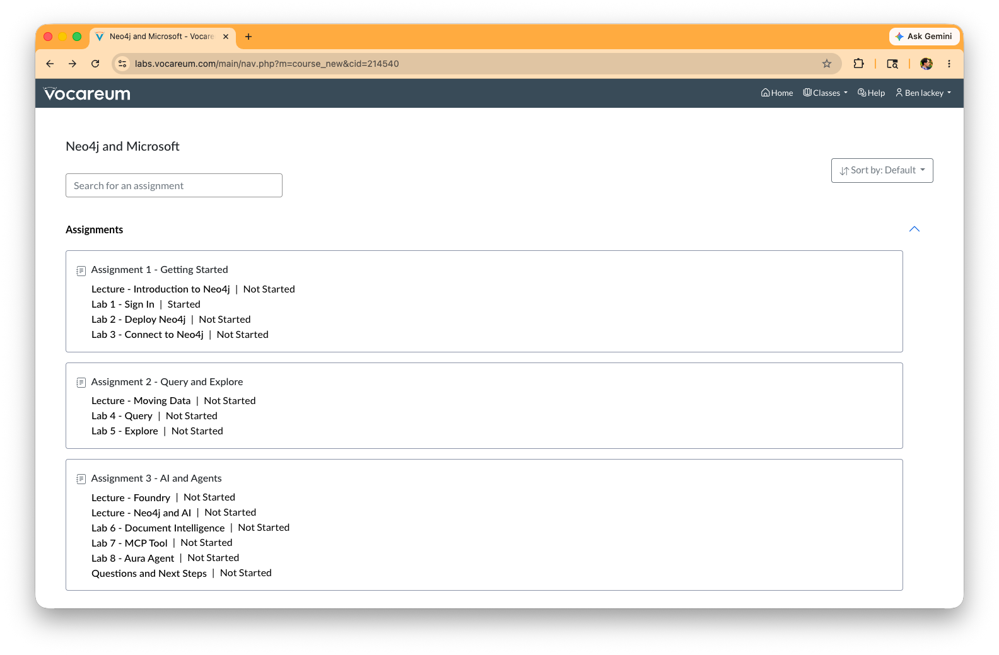
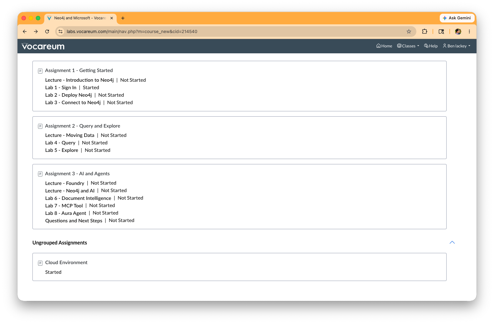
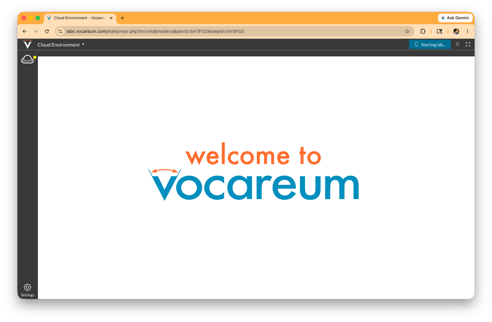
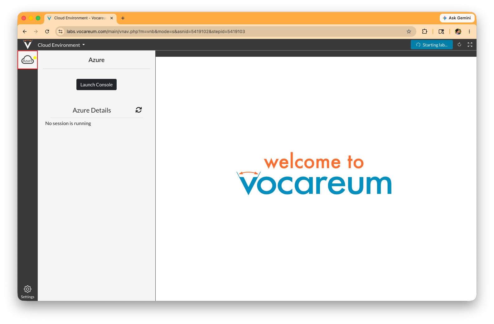
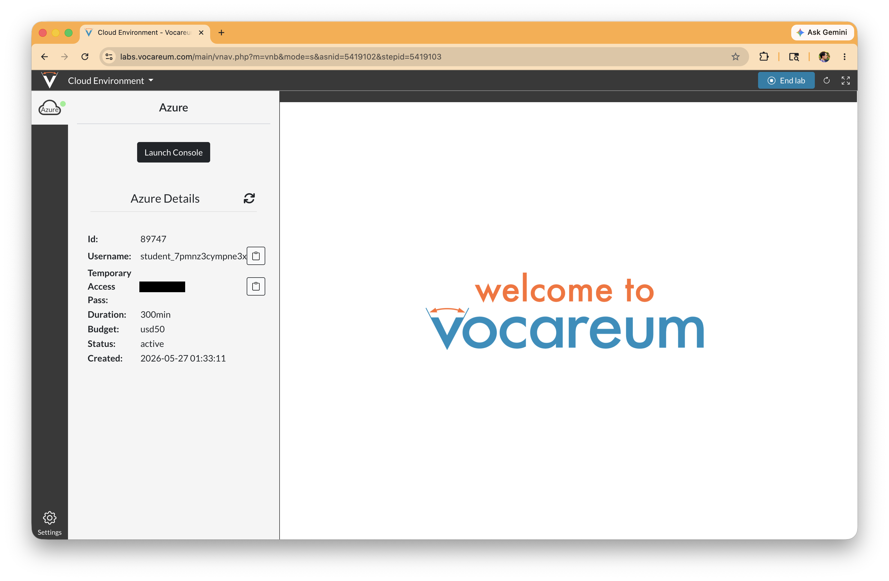
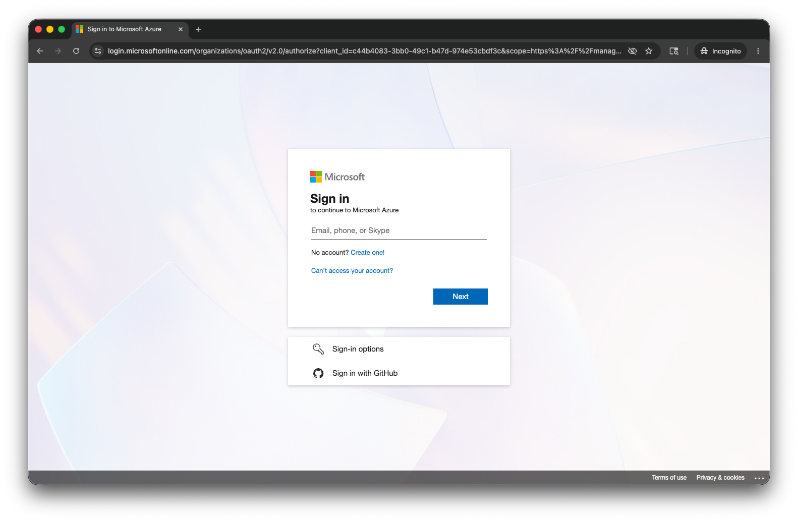
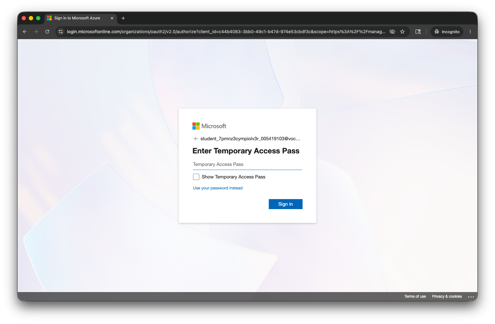
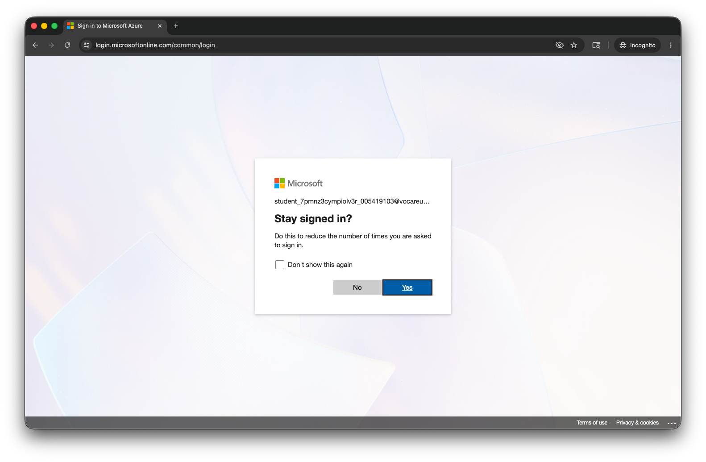
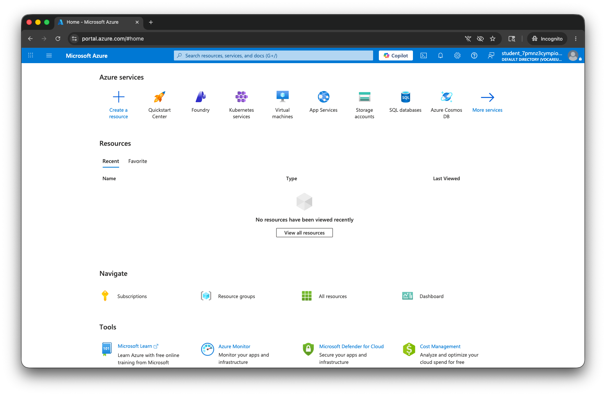

# Lab 1 - Sign In

Congratulations!  You logged into Vocareum and made it here!  The next step is going to be starting up your Microsoft Azure environment.

Open a window back on the Vocareum assignments page [here](https://labs.vocareum.com/main/nav.php?m=course_new&cid=213206).  Scroll down to the bottom of that window.

Click on "Cloud Environment" at the very bottom.

Click "Start lab" in the upper right.

It should now say "Starting lab."  Click the yellow icon for Azure on left to open up a screen with detail.

When complete and the icon is green, you should see Google credentials along the right side.  That is an ephemeral Microsoft Azure account.  You can use this to complete the lab.

We're now going to open the Microsoft Azure Portal at [https://portal.azure.com/](https://portal.azure.com/)

You probably want to open it in an incognito window.  Alternatively you can log out of any Microsoft account you're in and login with those credentials.

Enter your Vocareum credentials from the last step.  The email address will be something like student_7pmnz3cympefisn9_005419103@vocareumvocareum.onmicrosoft.com.  Click next.

Enter the password.  Click "Next."

Review the terms.  Click "I understand" if they are acceptable.

We're now in the Microsoft Azure Portal.  Click the check box if you agree to the terms.  Then click "Agree and continue."

Now you're all set, logged into a Microsoft Azure account.

In the next lab we'll deploy Neo4j.
