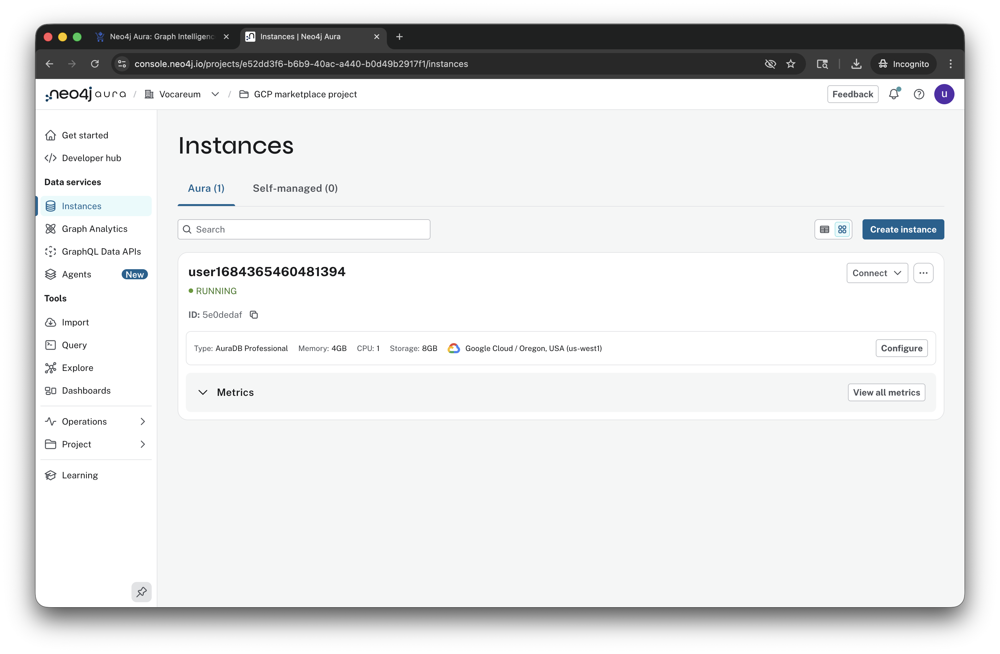
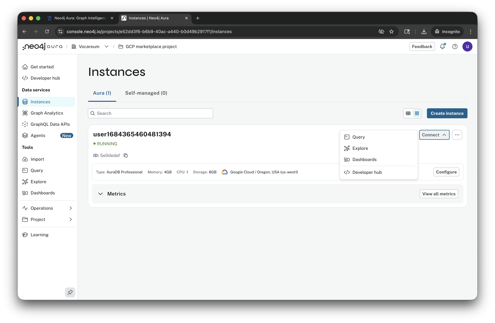
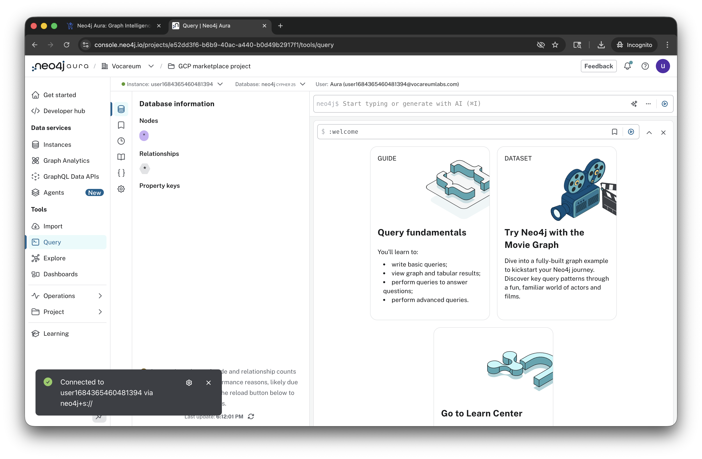
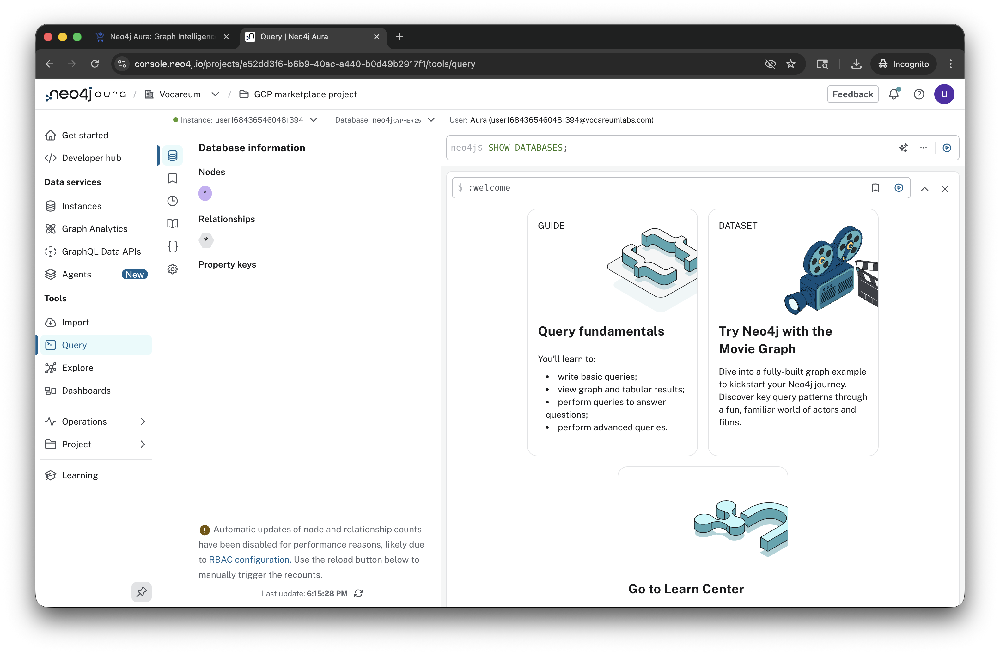
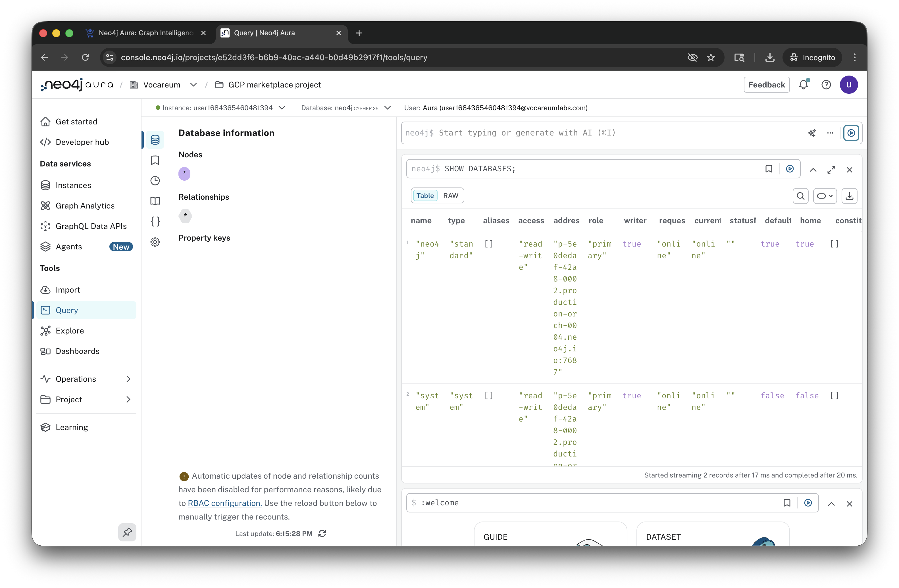

# Lab 3 - Connect to Neo4j

In this lab, we're going to connect to the Neo4j deployment we created in the previous step.  We'll start where we left off in lab 2.

Click "Connect."

Then select "Query."

That will drop us into an empty database.

There's nothing in our database yet.  We can see the nodes, relationships and property key areas are all blank.

We can try running a simple Cypher command.  For isntance we can show the databases in our instance.  We can do that by entering the following command into the Neo4j the query field:

    SHOW DATABASES;

Then press the triangle with a circle around it to run the query.

You can see we have two databases:

* neo4j - The default database
* system - Used by the system to store internal information

Assuming that all looks good, let's move on...
