# Lab 6 - Document Intelligence

Document Intelligence is a new tool within Neo4j Aura.  It's currently in a private preview.  We've enabled your account for this lab with it.

Document Intelligence transforms documents into knowledge graphs stored in Neo4j.  It's an evolution of an approach Neo4j has been pioneering with AI since 2022.  Early integrations focused on using [Langchain to build these architectures](https://www.youtube.com/watch?v=3PO-erAP6R4&list=PLG3nTnYVz3nya8Me9-Xj9vEuLYIOk03ba&index=8).  Many of our customers using AI to create knowledge graph continue to use this approach.  It's code heavy and deeply customizable.

More recently Neo4j Labs, our experimental department, built a [LLM Graph Builder application](https://neo4j.com/labs/genai-ecosystem/llm-graph-builder/) that packaged this approach in a nice UI.

Document Intelligence is the next evolution of this, built into our Neo4j Aura product.

First off, download [this pdf](https://neo4jdatasets.blob.core.windows.net/handsonlab/Apple_10-K_2025_2_pages.pdf) and take a peek at it.  It's 2 pages of the 2025 10-K filed by Apple.  We're going to generate a knowledge graph from it.

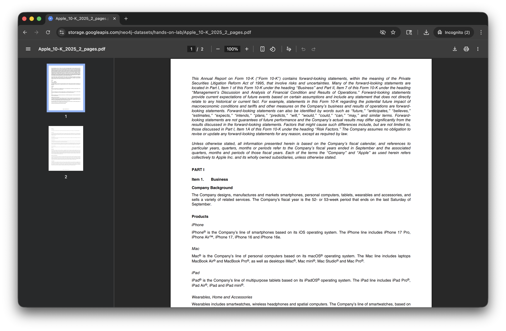

Now, let's go to our Neo4j Aura Console.  In the left menu, click on "Document Intelligence."

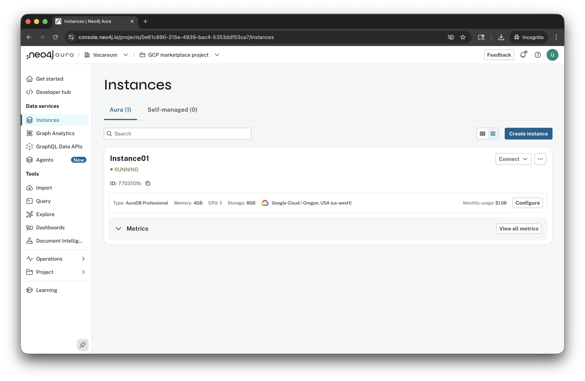

Click "Create graph model."

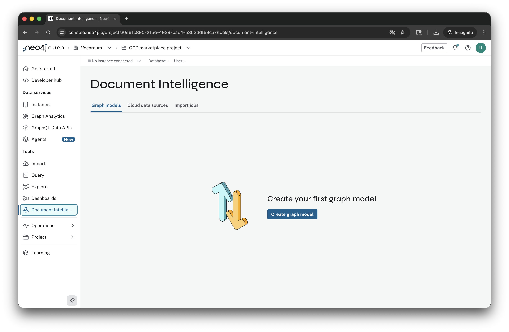

Click "Add data source."

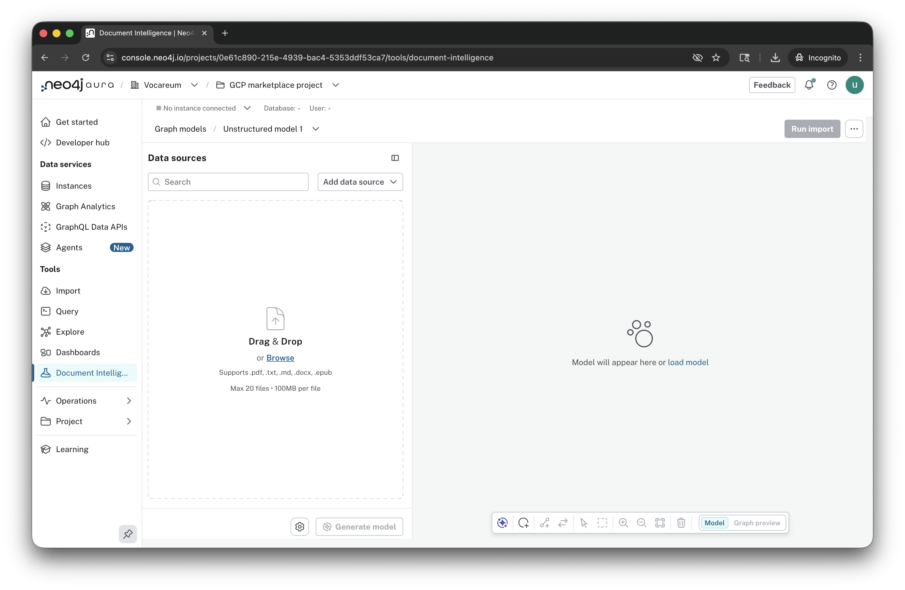

Click "Local files."

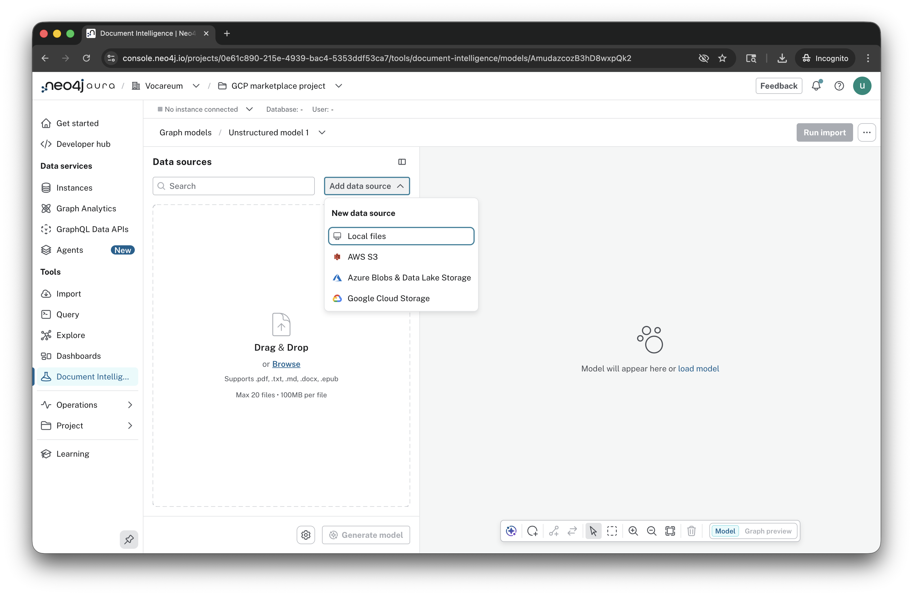

Select the file "hands-on-lab_Apple_10-K_2025_2_pages.pdf"

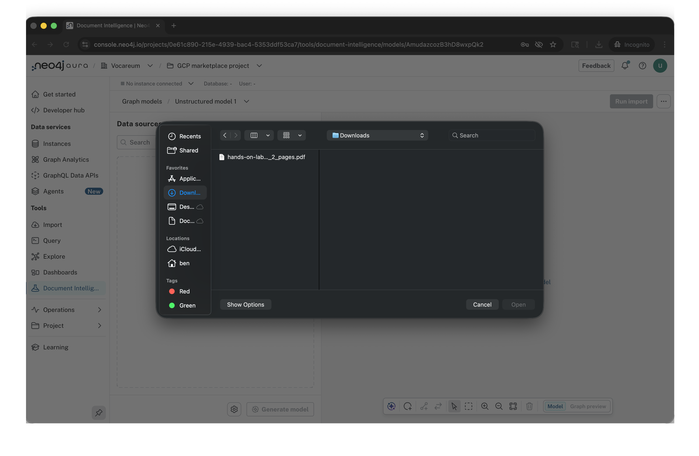

Now click "Generate model."

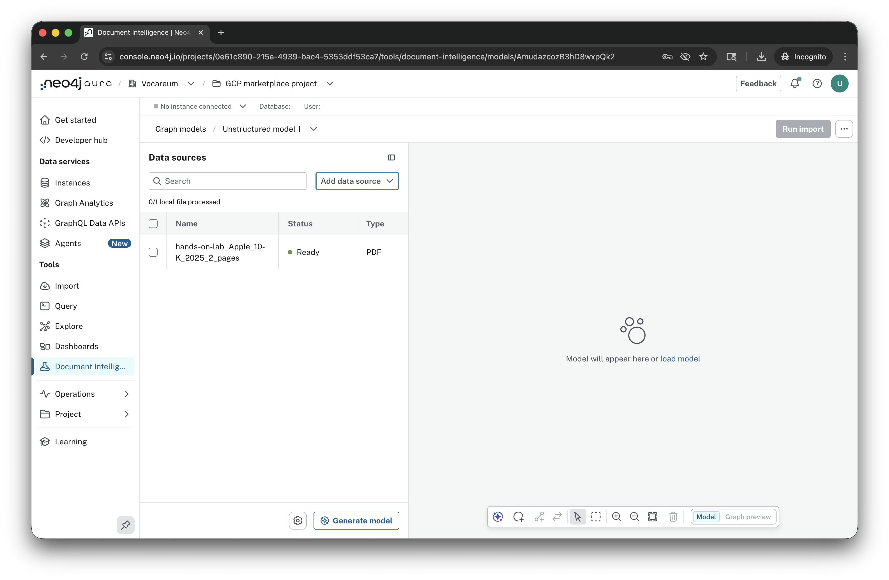

For the promp enter:

    Extract products, services, segments and competition.

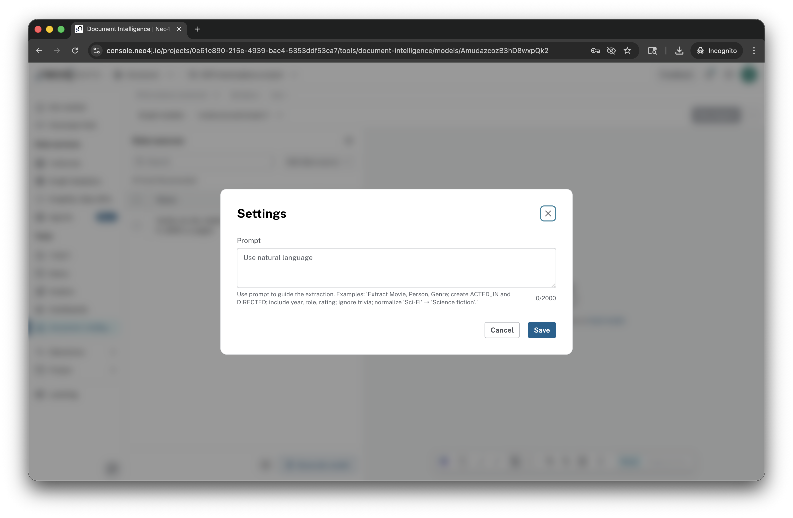

Click "Save."

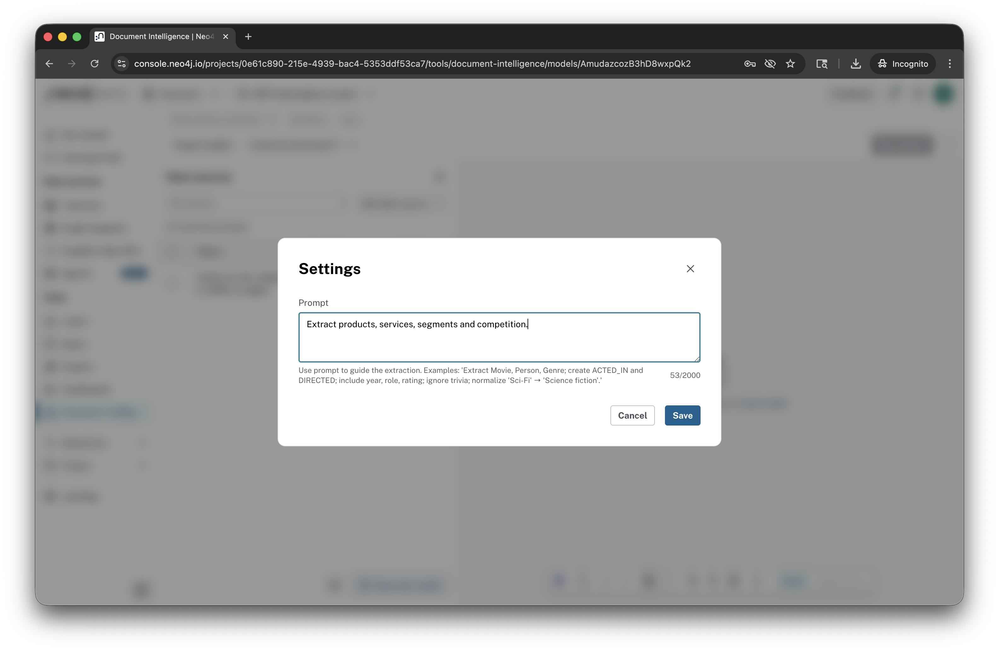

The generator will run for a bit.

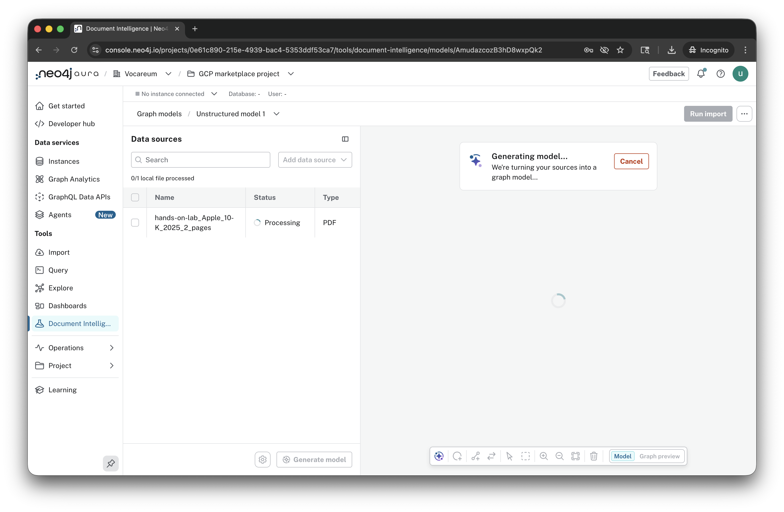

When complete, you'll see a neat graph model.  You can zoom in and around, inspecting it.

When you're done, click "Graph preview."

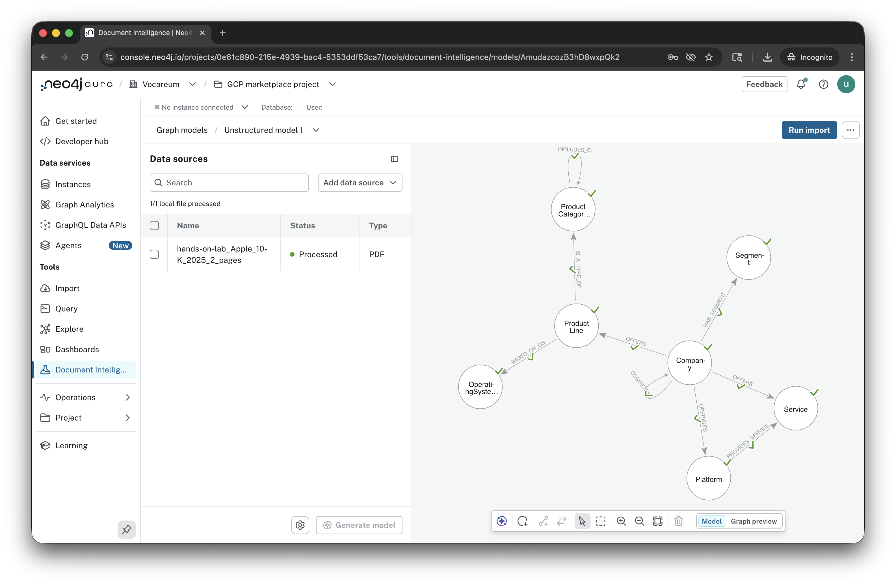

We can explore the model a bit, zooming in and inspecting.  

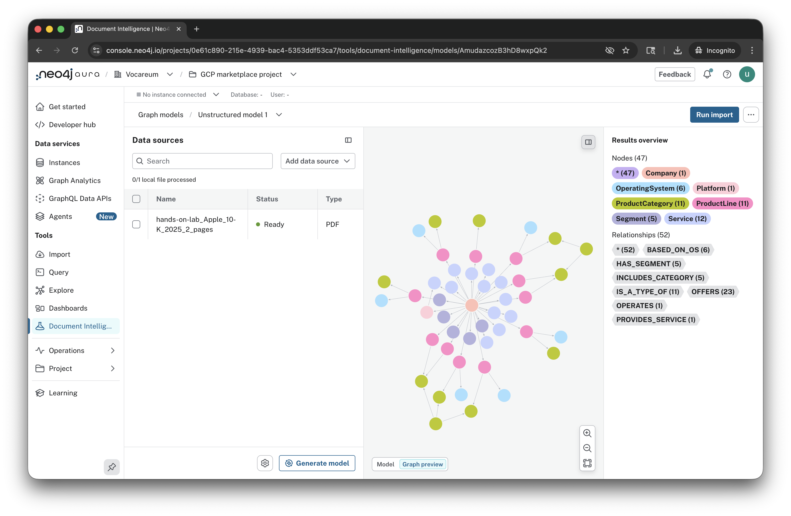

Click the icon in the upper right of the graph to expand the view.

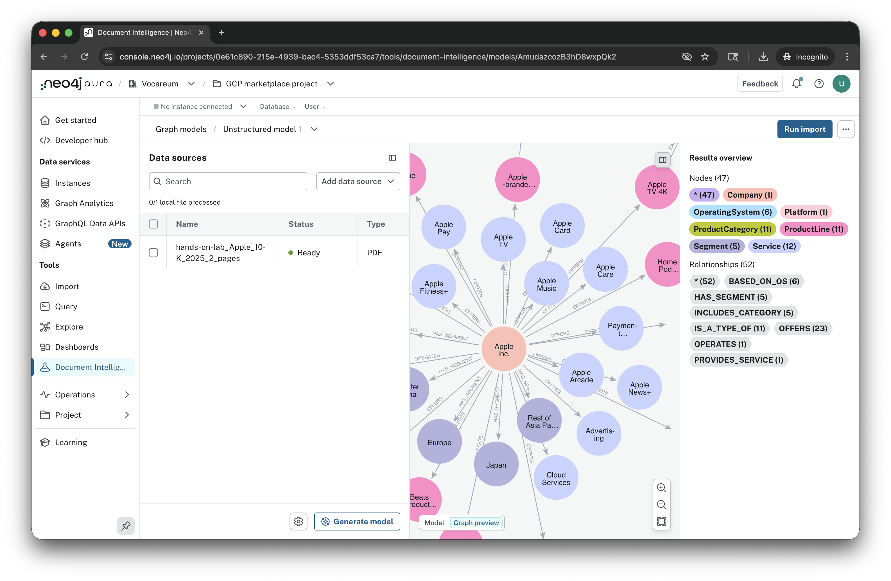

Explore a bit more...

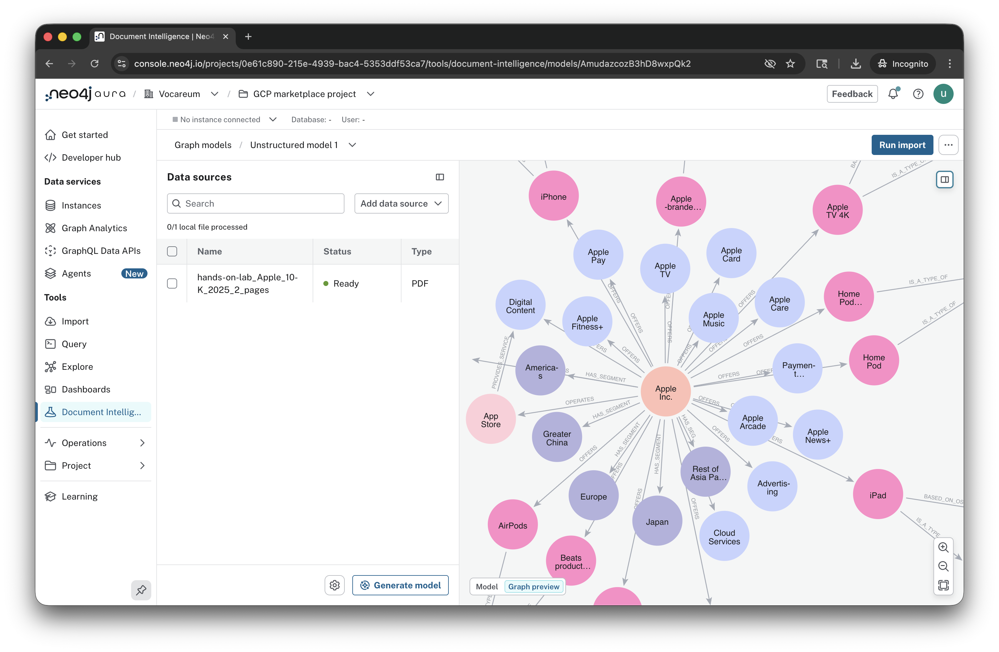

We can see the node for the home category includes streaming and wireless devices such as the HomePod, HomePod mini and Apple TV.

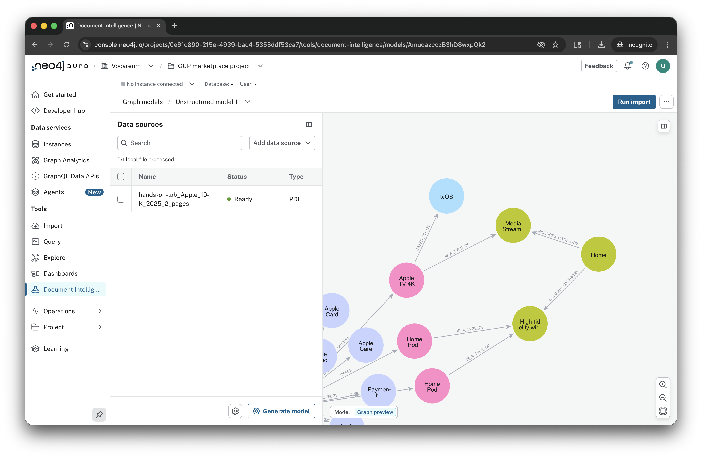

For the full graph query functionality, we would need to import this into a Neo4j instance.  We haven't had a chance to work it into the lab material yet.  Feel free to experiment though!

We really hope you enjoyed this preview of Document Intelligence.  Please stay tuned for the full release and updates!
