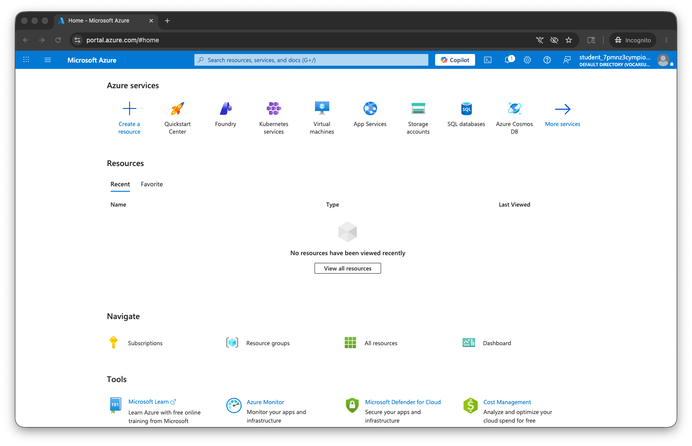
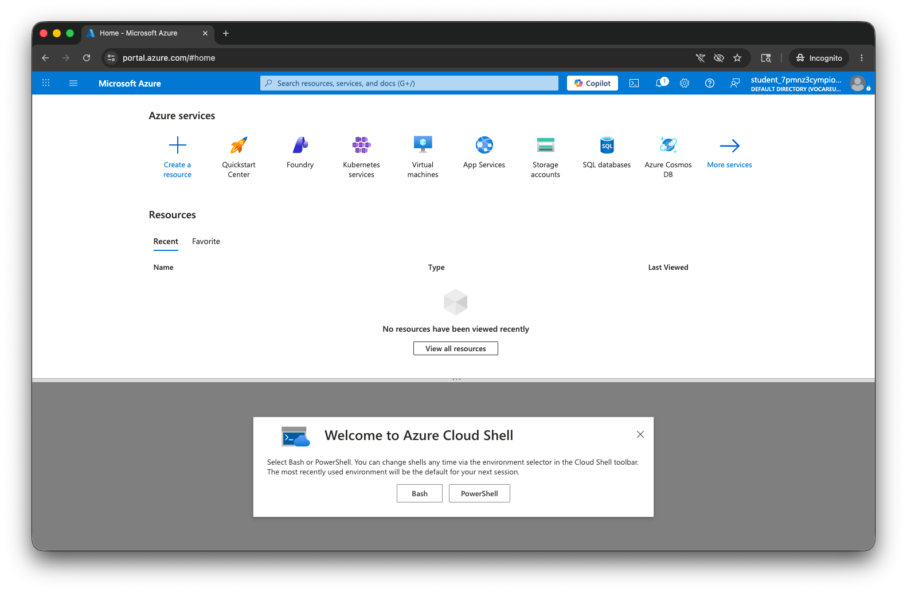
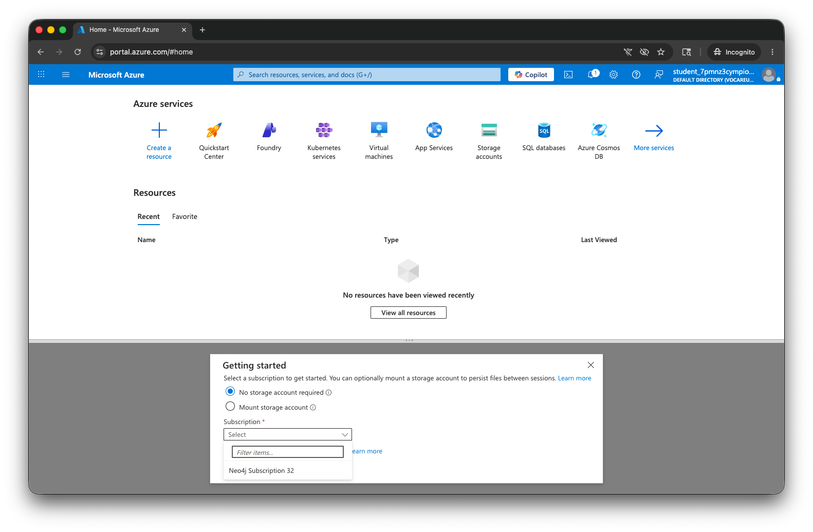
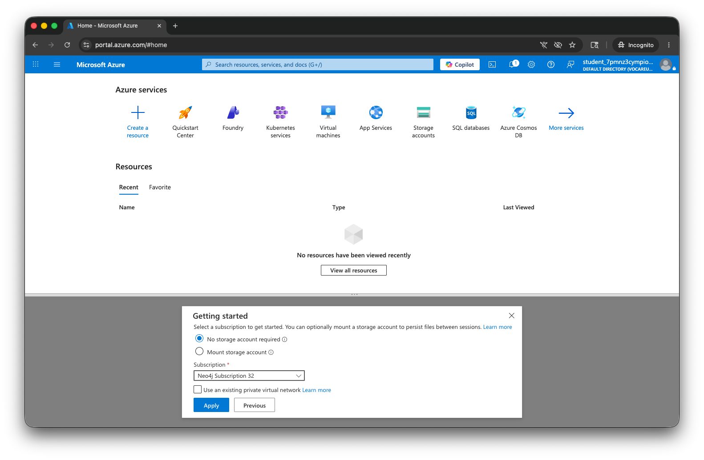
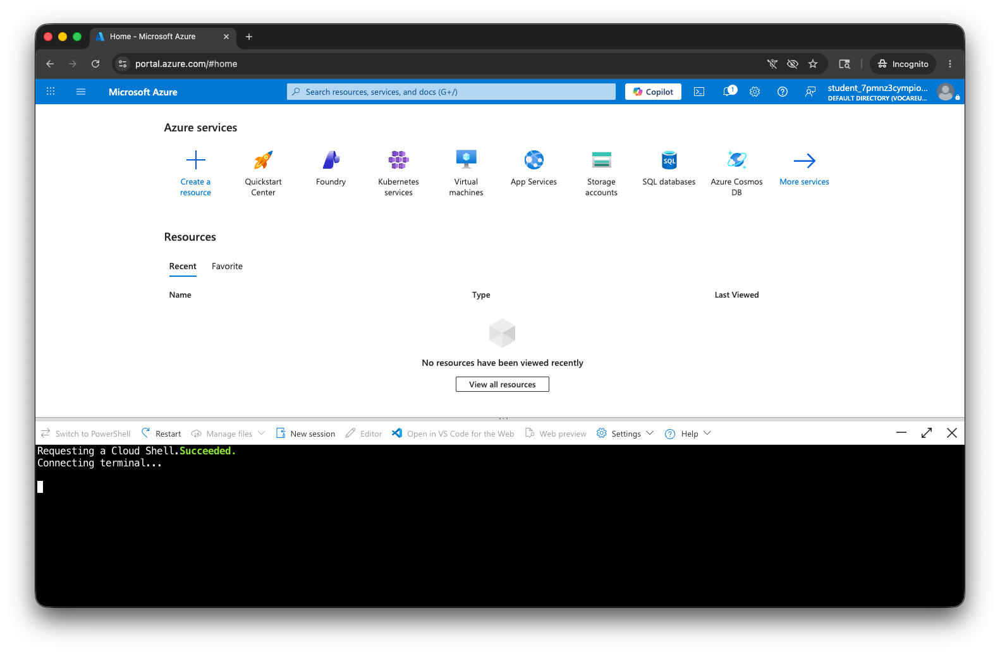
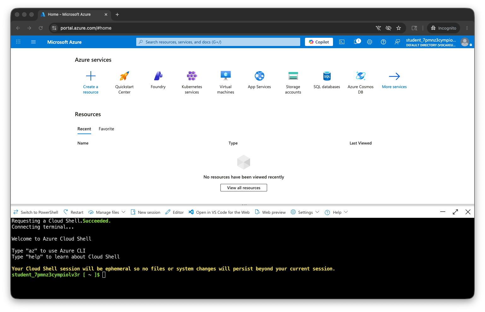
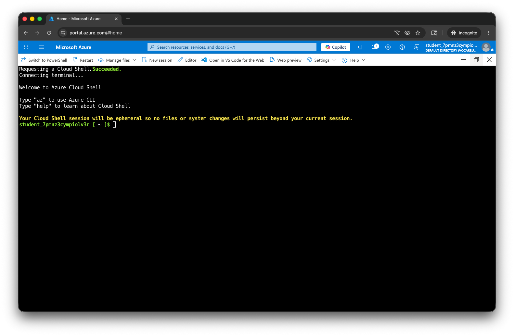
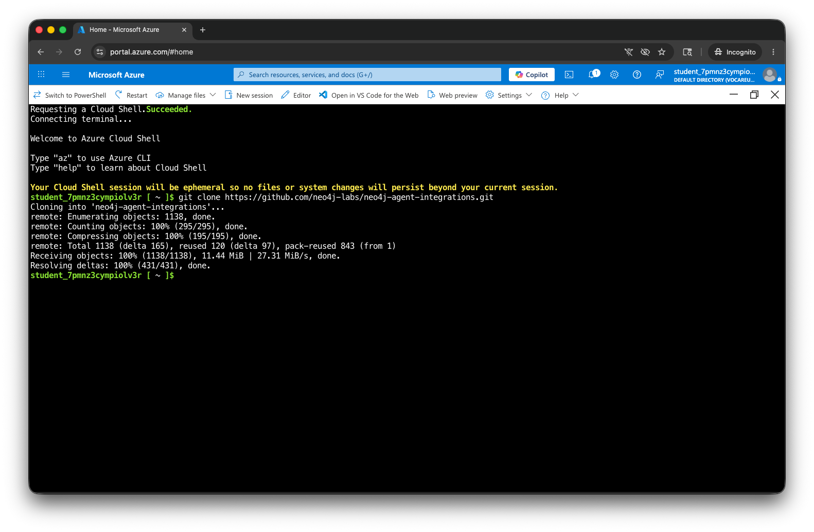

# Lab 7 - MCP Tool

Model Context Protocol (MCP) provides a standard interface for agents to speak with one another.  Neo4j has an open source [MCP server](https://github.com/neo4j/mcp).

Neo4j and Microsoft collaborated to build scripts exposing that MCP server in Microsoft Foundry.  Documentation on that is [here](https://neo4j.com/labs/genai-ecosystem/genai-frameworks/microsoft-foundry-mcp/).  The underlying code is [here](https://github.com/neo4j-labs/neo4j-agent-integrations/blob/main/microsoft-foundry/).

In this lab we'll use that.

To get started, open your Azure Portal.

Click the terminal icon in the top blue menu.  It is to the right of "Copilot."  That will open a cloud shell.

Select "Bash."

Click "Subscription."

Select your subscription.  In this case it was "Neo4j Subscription 32."

Click "Apply."

The Cloud Shell then takes a moment to start.

Click the arrow icon in the upper right of the Cloud Shell to expand it.

Now we're going to clone a GitHub repo with the MCP Tool in it.  Run the command:

    git clone https://github.com/neo4j-labs/neo4j-agent-integrations.git

Now let's cd into the Microsoft Foundry directory and see what we have in there.

    cd neo4j-agent-integrations
    cd microsoft-foundry/infra

This directory contains some deployment scripts, a README and some underlying code.  We're going to deploy the example, so run:

    ./deploy.sh

That creates a number of resources.  Investigate those in the portal.

Now let's run the server with:

    ./test-mcp.sh "$(azd env get-value mcpEndpoint)”

Now let's use the Foundry UI....
