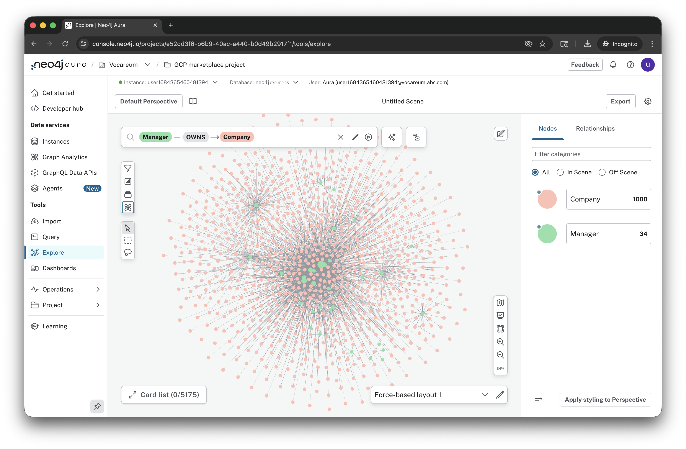
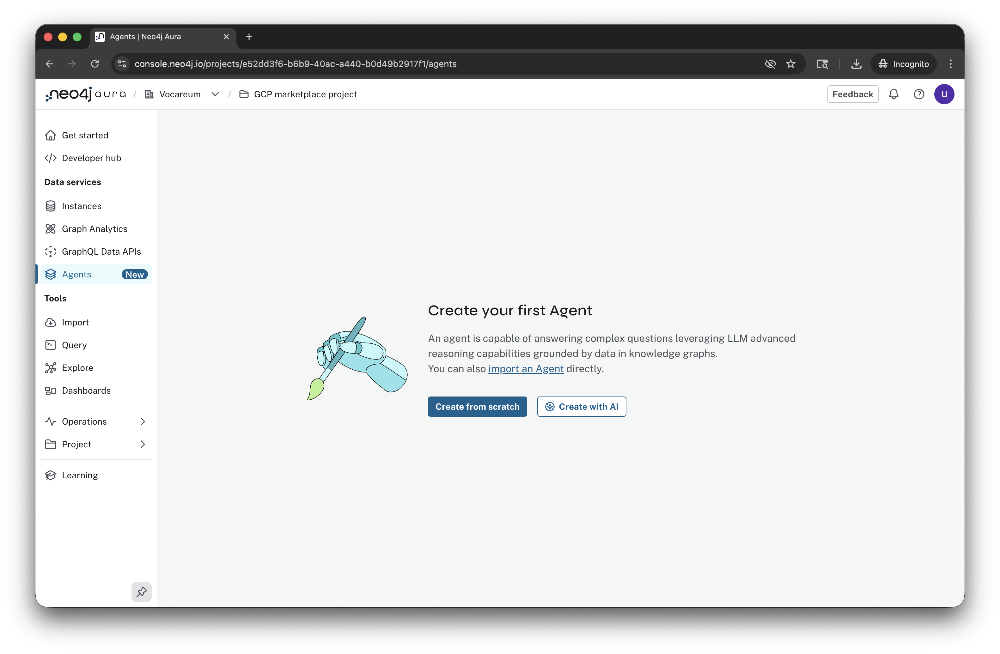
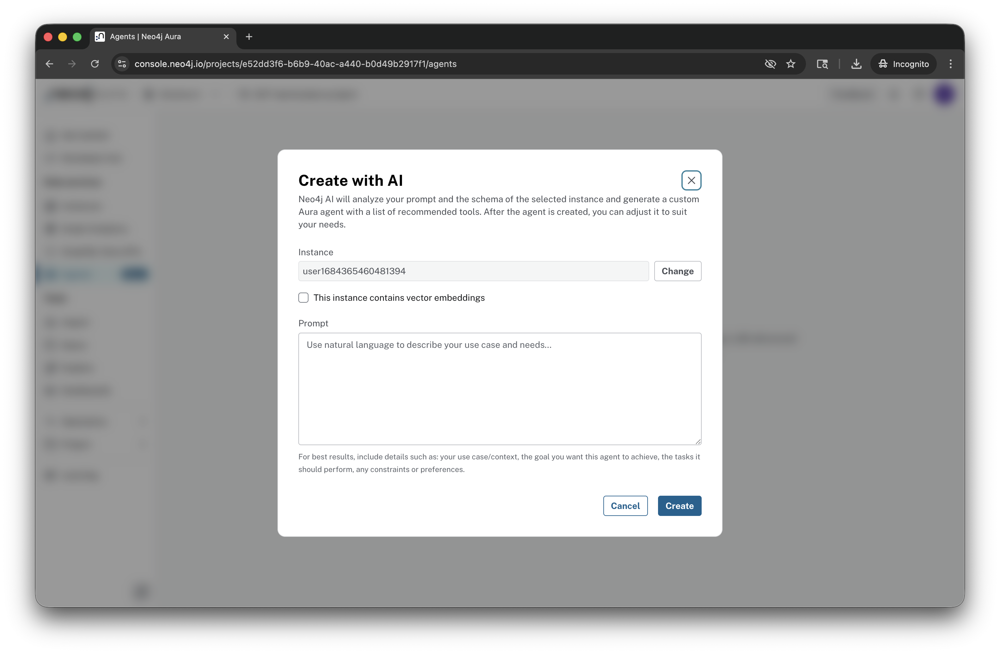
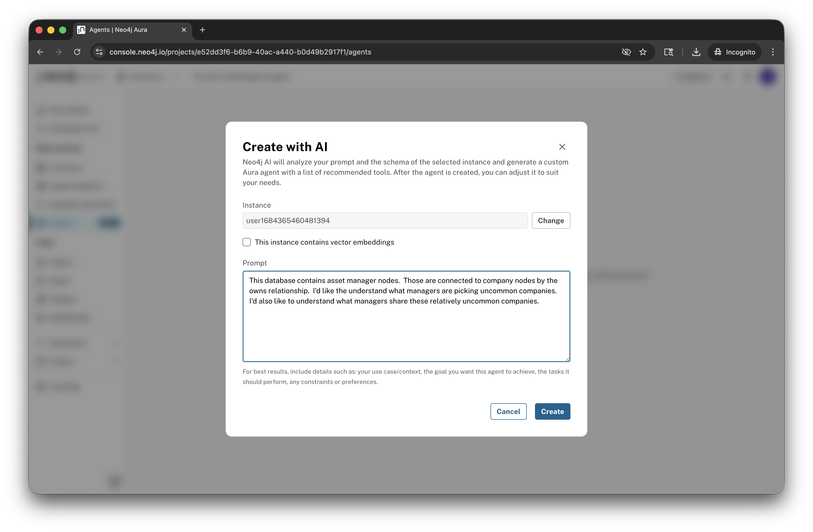
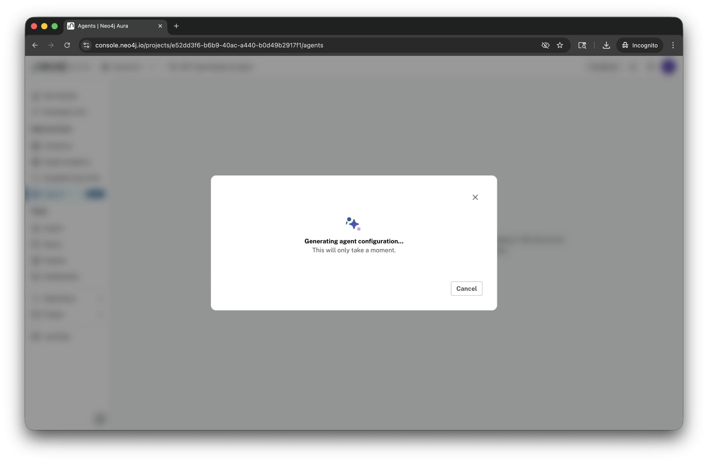
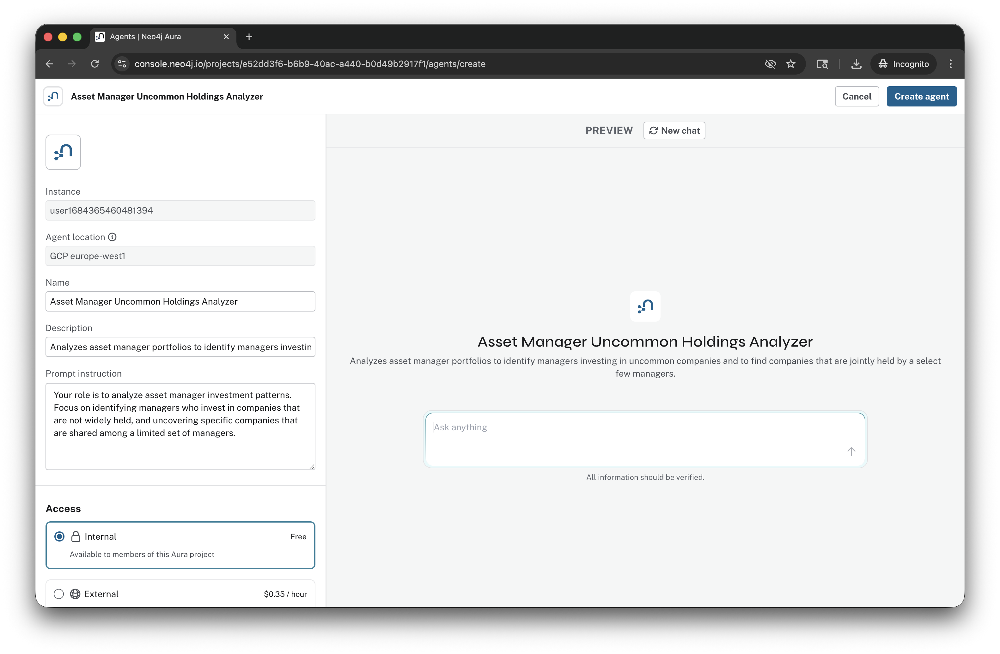
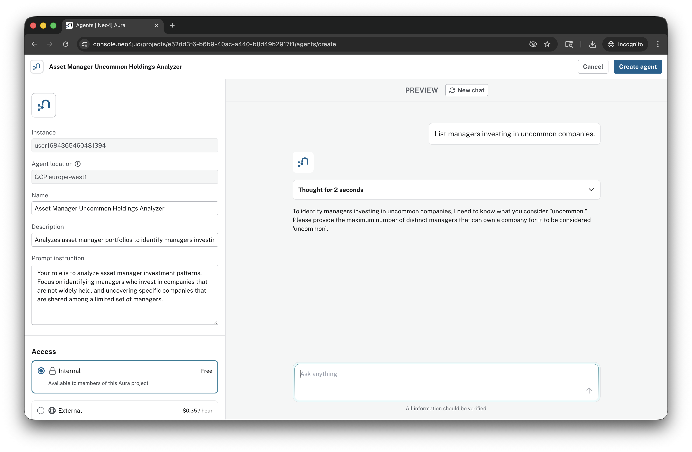
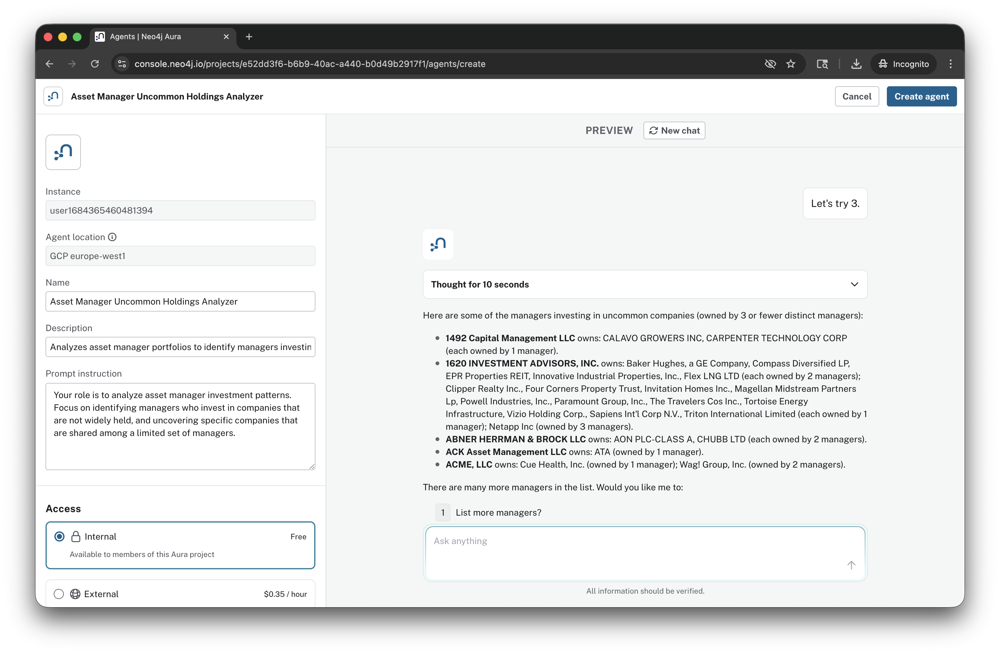

# Lab 9 - Aura Agent

In the Neo4j Aura console select "Agents."

Click "Create with AI."

Enter this prompt:

    This database contains asset manager nodes.  Those are connected to company nodes by the owns relationship.  I'd like the understand what managers are picking uncommon companies.  I'd also like to understand what managers share these relatively uncommon companies.

Click "Create."

Wait for the agent configuration to complete.

Type in:

    List managers investing in uncommon companies.

Press return.

Review the output.  In this case, I'll answer the question with:

    Let's try 3.

We see a list of such companies.

This is just scratching the surface of what is possible with these agents.  The UI we've used in the Neo4j Aura Console is a great way to get started.  Agents can be incorporated into larger agentic flows through APIs.

Experiment and have fun!
