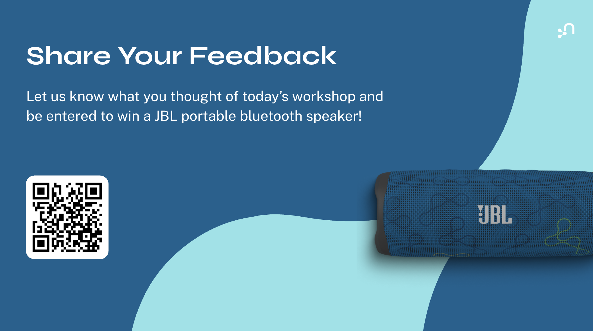

# Questions and Next Steps

This section has some thoughts on future work, improvements and next steps.  Known issues are [here](https://github.com/neo4j-partners/hands-on-lab-neo4j-and-microsoft/issues).  Please feel free to [PR](https://github.com/neo4j-partners/hands-on-lab-neo4j-and-microsoft/pulls) your ideas and suggestions.

## Lab 1 - Sign In

In previous versions of the lab we had users sign up for a free trial that they owned.  That was kinda cool in that attendees got to see everything start from scratch.  However, the signup required a credit card number and a phone number for identity verification.  It was also a fair bit of work.  Now we're using [Vocareum](https://www.vocareum.com/) to provision.  We'd be curious to hear how your experience was with this approach.

## Lab 2 - Deploy Neo4j

The lab deploys [Neo4j Aura](https://marketplace.microsoft.com/en-us/product/neo4j.neo4j-aura) through a deep integration in the Microsoft Marketplace.  There are many other ways to deploy Neo4j.  If Aura doesn't meet your needs, we probably have a different approach that does.  The [Marketplace](https://marketplace.microsoft.com/en-us/search/products?search=neo4j) is a good place to look for more options.

We encountered an issue in the interaction between the onmicrosoft.com accounts that Vocareum produces and a Neo4j requirement for a user ID tied to an underlying email.  That forced us to use a personal email for authentication.  Neo4j is working to resolve [this issue](https://github.com/neo4j-partners/hands-on-lab-neo4j-and-microsoft/issues/11).

## Lab 3 - Connect to Neo4j

We recently made some improvements to the punch out experience from the Azure Portal.  We believe that is working well but are curiosu for feedback.

## Lab 4 - Query

We used LOAD CSV to pull data in.  That is one of many ways.  Neo4j Data Importer is another.  You may have noticed the tab for that in Aura.

We also have Spark and Kafka connectivity.

## Lab 5 - Explore

This section of the lab could be expanded.

## Lab 6 - Document Intelligence

This is a public preview product.  You're some of the first to see it.  It has a lot of potential but work to do as well.  Previous approaches were very custom with custom code.  This aims to be a one size fits all general solution.

## Lab 7 - Deploy Foundry

The deployment experience in this lab relied on a script in Neo4j Labs.  Neo4j is working on hosting our MCP server as a SaaS in Foundry.  That would greatly simplify this experience.

## Lab 8 - Use Foundry

Improving responses is an area of both ongoing work and research.  This product is rapidly improving, though the queries in the lab could also be much better.

## Lab 9 - Aura Agents

We could immprove the queries here as well and explore a bit more about deploying agents too.

## Next Steps

We hope you enjoyed these labs.  If you have any questions, feel free to reach out directly to any of us.  We'd love the opportunity to explore and support your use cases with your data.

Your feedback is enormously appreciated.  If you see bugs, please report them [here](https://github.com/neo4j-partners/hands-on-lab-neo4j-and-microsoft/issues).

And, if you have time, please complete [this survey](https://www.surveymonkey.com/r/GKT92SS).

